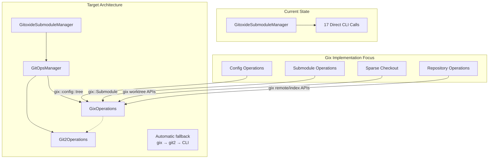

# Git Operations Refactoring Implementation Plan

## Executive Summary

This plan addresses the architectural disconnect between the intended design and current implementation. The [`GitoxideSubmoduleManager`](src/gitoxide_manager.rs) currently makes 17 direct CLI calls instead of using the [`GitOpsManager`](src/git_ops/mod.rs) abstraction. The [`gix_ops.rs`](src/git_ops/gix_ops.rs) implementation incorrectly assumes gix doesn't support many operations that are actually available.

## Current State Analysis

### Architecture Issues

- **Missing Integration**: [`GitoxideSubmoduleManager`](src/gitoxide_manager.rs) doesn't import or use git_ops modules
- **Incorrect Assumptions**: [`gix_ops.rs`](src/git_ops/gix_ops.rs) returns errors claiming gix lacks capabilities it actually has
- **CLI Dependency**: 17 operations use direct CLI calls instead of the trait-based abstraction

### Key Findings from Gitoxide Documentation

- **Submodule Support**: `gix::Submodule` type provides high-level abstraction
- **Config Management**: Type-safe configuration via `gix::config::tree` static keys
- **File Operations**: `.gitmodules` reading/writing capabilities exist
- **Sparse Checkout**: Worktree operations including sparse checkout are supported

## Implementation Plan

### Phase 1: Architecture Integration (Priority: Critical)

#### 1.1 Import GitOpsManager in GitoxideSubmoduleManager

```rust
// Add to src/gitoxide_manager.rs imports
use crate::git_ops::{GitOpsManager, GitOperations};
```

#### 1.2 Replace Repository Field

```rust
pub struct GitoxideSubmoduleManager {
    // Replace: repo: Repository,
    git_ops: GitOpsManager,
    config: Config,
    config_path: PathBuf,
}
```

#### 1.3 Update Constructor

```rust
impl GitoxideSubmoduleManager {
    pub fn new(config_path: PathBuf) -> Result<Self, SubmoduleError> {
        let git_ops = GitOpsManager::new(None)
            .map_err(|_| SubmoduleError::RepositoryError)?;
        // ... rest of constructor
    }
}
```

### Phase 2: Maximize Gix Implementation (Priority: High)

#### 2.1 Configuration Operations

**Target**: Replace CLI config operations with gix APIs

**Implementation Strategy**:

```rust
// In gix_ops.rs - implement using gix::config::tree static keys
fn read_git_config(&self, level: ConfigLevel) -> Result<GitConfig> {
    let config = self.repo.config_snapshot();
    let mut entries = HashMap::new();

    // Use type-safe config access
    if let Ok(value) = config.boolean(&gix::config::tree::Core::BARE) {
        entries.insert("core.bare".to_string(), value.to_string());
    }
    // ... implement for all config keys
    Ok(GitConfig { entries })
}

fn set_config_value(&self, key: &str, value: &str, level: ConfigLevel) -> Result<()> {
    let mut config = self.repo.config_snapshot_mut();
    config.set_value(key, value)?;
    Ok(())
}
```

#### 2.2 Submodule Operations

**Target**: Implement using `gix::Submodule` and `gix_submodule::File`

**Key Operations**:

```rust
fn read_gitmodules(&self) -> Result<SubmoduleEntries> {
    // Use gix::Repository::submodules() iterator
    if let Some(submodule_iter) = self.repo.submodules()? {
        for submodule in submodule_iter {
            // Extract name, path, url using gix APIs
            let name = submodule.name().to_string();
            let path = submodule.path()?.to_string();
            let url = submodule.url()?.to_string();

            // Check if active using submodule.is_active()
            let active = submodule.is_active()?;
        }
    }
}

fn add_submodule(&mut self, opts: &SubmoduleAddOptions) -> Result<()> {
    // Research gix submodule addition APIs
    // Implement using gix_submodule::File for .gitmodules manipulation
    // Use gix config APIs for submodule configuration
}
```

#### 2.3 Sparse Checkout Operations

**Target**: Implement using gix worktree and config APIs

```rust
fn enable_sparse_checkout(&self, path: &str) -> Result<()> {
    // Use gix config API to set core.sparseCheckout = true
    let mut config = self.repo.config_snapshot_mut();
    config.set_value(&gix::config::tree::Core::SPARSE_CHECKOUT, "true")?;
    Ok(())
}

fn set_sparse_patterns(&self, path: &str, patterns: &[String]) -> Result<()> {
    // Write to .git/info/sparse-checkout using gix file APIs
    let git_dir = self.repo.git_dir();
    let sparse_file = git_dir.join("info").join("sparse-checkout");
    // Use gix file operations for atomic writes
}
```

### Phase 3: CLI Call Migration (Priority: High)

#### 3.1 Map CLI Calls to GitOperations Methods

**From FEATURE_CODE_REVIEW.md**, replace these 17 CLI calls:

| Current CLI Call | Target GitOperations Method | Implementation Priority |
|------------------|----------------------------|------------------------|
| `git config core.sparseCheckout true` | `set_config_value()` | High |
| `git sparse-checkout set` | `set_sparse_patterns()` + `apply_sparse_checkout()` | High |
| `git submodule deinit -f` | `deinit_submodule()` | Medium |
| `git rm --cached -f` | Custom index manipulation | Medium |
| `git clean -fd` | `clean_submodule()` | Medium |
| `git submodule add --force` | `add_submodule()` | High |
| `git submodule init` | `init_submodule()` | High |
| `git submodule update` | `update_submodule()` | High |
| `git pull origin HEAD` | `fetch_submodule()` + merge logic | Medium |
| `git stash push --include-untracked` | `stash_submodule()` | Low |
| `git reset --hard HEAD` | `reset_submodule()` | Medium |
| `git clean -fdx` | `clean_submodule()` | Medium |

#### 3.2 Update GitoxideSubmoduleManager Methods

**Replace CLI calls in these methods**:

- [`cleanup_existing_submodule()`](src/gitoxide_manager.rs:321)
- [`add_submodule_with_cli()`](src/gitoxide_manager.rs:399)
- [`configure_sparse_checkout()`](src/gitoxide_manager.rs:532)
- [`apply_sparse_checkout_cli()`](src/gitoxide_manager.rs:636)
- [`update_submodule()`](src/gitoxide_manager.rs:652)
- [`reset_submodule()`](src/gitoxide_manager.rs:683)
- [`init_submodule()`](src/gitoxide_manager.rs:751)

### Phase 4: Advanced Gix Research & Implementation

#### 4.1 Research Gix Capabilities

**Areas requiring investigation**:

- Submodule CRUD operations using `gix_submodule::File`
- Index manipulation for submodule entries (for sparse checkout/indexes)
- Worktree operations for sparse checkout
- Remote operations for fetch/pull
- Stash operations (may need git2 fallback)

#### 4.2 Implement Complex Operations

**Submodule Addition**:

```rust
fn add_submodule(&mut self, opts: &SubmoduleAddOptions) -> Result<()> {
    // 1. Update .gitmodules using gix_submodule::File
    // 2. Add to index using gix index APIs
    // 3. Clone repository using gix clone APIs
    // 4. Configure submodule using gix config APIs
}
```

**Sparse Checkout Application**:

```rust
fn apply_sparse_checkout(&self, path: &str) -> Result<()> {
    // 1. Read sparse patterns from .git/info/sparse-checkout
    // 2. Use gix worktree APIs to apply patterns
    // 3. Update working directory to match patterns
}
```

## Implementation Architecture



## Implementation Phases Timeline

```mermaid
gantt
    title Git Operations Refactoring Timeline
    dateFormat X
    axisFormat %d

    section Phase 1: Architecture
    Import GitOpsManager     :p1a, 0, 1
    Replace Repository Field :p1b, after p1a, 1
    Update Constructor       :p1c, after p1b, 1

    section Phase 2: Gix Implementation
    Config Operations        :p2a, after p1c, 2
    Submodule Read Operations:p2b, after p1c, 2
    Sparse Checkout Basic    :p2c, after p2a, 2

    section Phase 3: CLI Migration
    High Priority Calls      :p3a, after p2b, 3
    Medium Priority Calls    :p3b, after p3a, 2
    Low Priority Calls       :p3c, after p3b, 1

    section Phase 4: Advanced
    Research Complex Ops     :p4a, after p2c, 2
    Implement Advanced Ops   :p4b, after p4a, 3
    Optimization            :p4c, after p4b, 1
```



## Detailed Implementation Steps

### Phase 1: Architecture Integration

#### Step 1.1: Import and Setup GitOpsManager

1. Add imports to [`src/gitoxide_manager.rs`](src/gitoxide_manager.rs)
2. Replace `Repository` field with `GitOpsManager`
3. Update constructor to initialize `GitOpsManager`
4. Update all method signatures to use `&self.git_ops` instead of `&self.repo`

#### Step 1.2: Update Method Calls

1. Replace direct repository access with trait method calls
2. Handle error conversion from `GitOperationsError` to `SubmoduleError`
3. Maintain existing public API compatibility

### Phase 2: Gix Implementation Maximization

#### Step 2.1: Configuration Operations

**Priority: High** - These are used extensively in sparse checkout

1. **Research gix config APIs**:
   - `gix::config::tree` static keys for type safety
   - `gix::Repository::config_snapshot()` for reading
   - `gix::Repository::config_snapshot_mut()` for writing

2. **Implement `set_config_value()`**:

   ```rust
   fn set_config_value(&self, key: &str, value: &str, level: ConfigLevel) -> Result<()> {
       let mut config = self.repo.config_snapshot_mut();
       match level {
           ConfigLevel::Local => {
               config.set_value(&gix::config::tree::Key::from_str(key)?, value)?;
           }
           // Handle other levels
       }
       Ok(())
   }
   ```

3. **Implement `read_git_config()`**:
   - Use type-safe config key access
   - Handle different config levels (local, global, system)
   - Return structured `GitConfig` object

#### Step 2.2: Submodule Operations

**Priority: High** - Core functionality

1. **Research gix submodule APIs**:
   - `gix::Repository::submodules()` for iteration
   - `gix::Submodule` type for individual operations
   - `gix_submodule::File` for .gitmodules manipulation

2. **Implement `read_gitmodules()`**:

   ```rust
   fn read_gitmodules(&self) -> Result<SubmoduleEntries> {
       let mut entries = HashMap::new();

       if let Some(submodules) = self.repo.submodules()? {
           for submodule in submodules {
               let name = submodule.name().to_string();
               let entry = SubmoduleEntry {
                   name: name.clone(),
                   path: submodule.path()?.to_string(),
                   url: submodule.url()?.to_string(),
                   active: submodule.is_active()?,
               };
               entries.insert(name, entry);
           }
       }

       Ok(SubmoduleEntries { entries })
   }
   ```

3. **Implement `write_gitmodules()`**:
   - Use `gix_submodule::File` for atomic .gitmodules updates
   - Handle file locking and error recovery

#### Step 2.3: Sparse Checkout Operations

**Priority: High** - Heavily used feature

1. **Research gix sparse checkout APIs**:
   - Worktree manipulation APIs
   - Index update operations
   - File pattern matching

2. **Implement `enable_sparse_checkout()`**:

   ```rust
   fn enable_sparse_checkout(&self, path: &str) -> Result<()> {
       // Set core.sparseCheckout = true
       self.set_config_value("core.sparseCheckout", "true", ConfigLevel::Local)?;

       // Ensure .git/info directory exists
       let git_dir = self.repo.git_dir();
       let info_dir = git_dir.join("info");
       std::fs::create_dir_all(&info_dir)?;

       Ok(())
   }
   ```

3. **Implement `set_sparse_patterns()` and `apply_sparse_checkout()`**:
   - Write patterns to `.git/info/sparse-checkout`
   - Use gix worktree APIs to apply patterns
   - Handle file system updates

### Phase 3: CLI Call Migration

#### Step 3.1: High Priority CLI Replacements

**Target Methods in [`GitoxideSubmoduleManager`](src/gitoxide_manager.rs)**:

1. **`configure_sparse_checkout()` (line 532)**:

   ```rust
   // Replace: Command::new("git").args(["config", "core.sparseCheckout", "true"])
   self.git_ops.set_config_value("core.sparseCheckout", "true", ConfigLevel::Local)?;
   ```

2. **`apply_sparse_checkout_cli()` (line 636)**:

   ```rust
   // Replace: Command::new("git").args(["sparse-checkout", "set"])
   self.git_ops.set_sparse_patterns(&submodule_path, &patterns)?;
   self.git_ops.apply_sparse_checkout(&submodule_path)?;
   ```

3. **`add_submodule_with_cli()` (line 399)**:

   ```rust
   // Replace: Command::new("git").args(["submodule", "add", "--force"])
   let opts = SubmoduleAddOptions {
       url: url.clone(),
       path: path.clone(),
       force: true,
       branch: None,
   };
   self.git_ops.add_submodule(&opts)?;
   ```

#### Step 3.2: Medium Priority CLI Replacements

1. **`cleanup_existing_submodule()` (line 321)**:
   - Replace `git submodule deinit -f` with `deinit_submodule()`
   - Replace `git rm --cached -f` with index manipulation
   - Replace `git clean -fd` with `clean_submodule()`

2. **`update_submodule()` (line 652)**:
   - Replace `git submodule update` with `update_submodule()`
   - Replace `git pull origin HEAD` with `fetch_submodule()` + merge

3. **`reset_submodule()` (line 683)**:
   - Replace `git reset --hard HEAD` with `reset_submodule()`
   - Replace `git clean -fdx` with `clean_submodule()`

### Phase 4: Advanced Gix Research & Implementation

#### Step 4.1: Complex Submodule Operations

**Research Areas**:

1. **Submodule Addition**: How to use gix APIs for complete submodule setup
2. **Index Manipulation**: Direct index operations for submodule entries
3. **Remote Operations**: Fetch/pull using gix remote APIs
4. **Stash Operations**: Determine if gix supports stashing (may need git2 fallback)

**Implementation Strategy**:

```rust
fn add_submodule(&mut self, opts: &SubmoduleAddOptions) -> Result<()> {
    // 1. Clone the repository to the target path
    let clone_opts = gix::clone::Options::default();
    let repo = gix::clone(&opts.url, &opts.path, clone_opts)?;

    // 2. Update .gitmodules file
    let gitmodules_path = self.repo.work_dir().unwrap().join(".gitmodules");
    let mut gitmodules = gix_submodule::File::from_path(&gitmodules_path)?;
    gitmodules.add_submodule(&opts.name, &opts.path, &opts.url)?;
    gitmodules.write()?;

    // 3. Add submodule to index
    let mut index = self.repo.index()?;
    index.add_submodule(&opts.path, &repo.head_commit()?.id())?;
    index.write()?;

    // 4. Configure submodule
    self.set_config_value(
        &format!("submodule.{}.url", opts.name),
        &opts.url,
        ConfigLevel::Local
    )?;

    Ok(())
}
```

#### Step 4.2: Advanced Worktree Operations

**Sparse Checkout Implementation**:

```rust
fn apply_sparse_checkout(&self, path: &str) -> Result<()> {
    // 1. Read sparse patterns
    let git_dir = self.repo.git_dir();
    let sparse_file = git_dir.join("info").join("sparse-checkout");
    let patterns = std::fs::read_to_string(&sparse_file)?;

    // 2. Use gix worktree APIs to apply patterns
    let worktree = self.repo.worktree()?;
    worktree.apply_sparse_patterns(&patterns.lines().collect::<Vec<_>>())?;

    // 3. Update working directory
    worktree.checkout_head()?;

    Ok(())
}
```

## Success Criteria

1. **Architecture Integration**: [`GitoxideSubmoduleManager`](src/gitoxide_manager.rs) uses [`GitOpsManager`](src/git_ops/mod.rs) instead of direct CLI calls
2. **Gix Maximization**: All 17 CLI operations replaced with gix-first implementations
3. **Fallback Preservation**: git2 and CLI fallbacks remain functional
4. **Feature Parity**: All existing functionality preserved
5. **Performance**: Operations should be faster or equivalent to CLI calls

## Risk Mitigation

- **Gix API Limitations**: Maintain git2 fallbacks for operations that prove too complex
- **Breaking Changes**: Implement behind feature flags initially
- **Performance Regression**: Profile operations and optimize critical paths
- **Configuration Complexity**: Use type-safe gix config APIs to prevent errors

## Testing Strategy

While comprehensive testing is out of scope for this implementation phase, the following testing approach should be considered:

1. **Unit Tests**: Test individual GitOperations trait methods
2. **Integration Tests**: Test complete submodule workflows
3. **Regression Tests**: Ensure CLI replacement maintains identical behavior
4. **Performance Tests**: Benchmark gix vs CLI operations

## Dependencies and Prerequisites

- **Gix Version**: Ensure latest gix version with required APIs
- **Feature Flags**: May need to enable specific gix features
- **Documentation**: Access to gix API documentation and examples

This plan maximizes gix usage while maintaining the robust fallback architecture, ensuring we get the performance benefits of gitoxide while preserving reliability.
