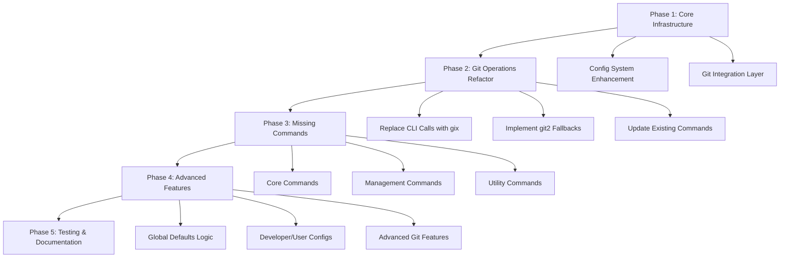

<!--
SPDX-FileCopyrightText: 2025 Adam Poulemanos <89049923+bashandbone@users.noreply.github.com>

SPDX-License-Identifier: LicenseRef-PlainMIT OR MIT
-->

# Submod CLI Tool Refactor Implementation Plan

## Overview

This plan outlines the systematic refactor of the submod CLI tool to eliminate git CLI calls and implement missing commands, following a **gix-first, git2-fallback** strategy while leveraging the existing type system and figment configuration.

## Current State Analysis

### ✅ Already Implemented

- **Commands**: `add`, `check`, `init`, `update`, `reset`, `sync`
- **Core Infrastructure**:
  - Robust type system in [`options.rs`](src/options.rs) with gix/git2 interoperability
  - Figment-based configuration in [`config.rs`](src/config.rs)
  - Git repository utilities in [`utilities.rs`](src/utilities.rs)
  - Comprehensive test suite

### ❌ Missing Implementations

- **Commands**: `change`, `change-global`, `list`, `delete`, `disable`, `generate-config`, `nuke-it-from-orbit`, `completions`
- **CLI Arguments**: `--shallow`, `--no-init` in `add` command
- **Git Operations**: Many operations still use git CLI calls instead of gix/git2

## Implementation Strategy



## Phase 1: Core Infrastructure Enhancement

### 1.1 Git Integration Layer

Create a unified git operations layer that abstracts gix/git2 operations with detailed fallback mechanisms:

**New Module**: [`src/git_ops.rs`](src/git_ops.rs)

```rust
use anyhow::Result;
use std::path::{Path, PathBuf};
use crate::options::{SerializableIgnore, SerializableUpdate, SerializableFetchRecurse, SerializableBranch};

/// Configuration levels for git config operations
#[derive(Debug, Clone, Copy)]
pub enum ConfigLevel {
    System,
    Global,
    Local,
    Worktree,
}

/// Options for adding a submodule
#[derive(Debug, Clone)]
pub struct SubmoduleAddOptions {
    pub name: String,
    pub path: PathBuf,
    pub url: String,
    pub branch: Option<SerializableBranch>,
    pub ignore: Option<SerializableIgnore>,
    pub update: Option<SerializableUpdate>,
    pub fetch_recurse: Option<SerializableFetchRecurse>,
    pub shallow: bool,
    pub no_init: bool,
}

/// Options for updating a submodule
#[derive(Debug, Clone)]
pub struct SubmoduleUpdateOptions {
    pub strategy: SerializableUpdate,
    pub recursive: bool,
    pub force: bool,
}

/// Represents git configuration state
#[derive(Debug, Clone)]
pub struct GitConfig {
    pub entries: std::collections::HashMap<String, String>,
}

/// Represents .gitmodules configuration
#[derive(Debug, Clone)]
pub struct GitModulesConfig {
    pub submodules: std::collections::HashMap<String, SubmoduleEntry>,
}

#[derive(Debug, Clone)]
pub struct SubmoduleEntry {
    pub path: String,
    pub url: String,
    pub branch: Option<String>,
    pub ignore: Option<SerializableIgnore>,
    pub update: Option<SerializableUpdate>,
    pub fetch_recurse: Option<SerializableFetchRecurse>,
    pub active: bool,
}

/// Comprehensive submodule status information
#[derive(Debug, Clone)]
pub struct DetailedSubmoduleStatus {
    pub path: String,
    pub name: String,
    pub url: Option<String>,
    pub head_oid: Option<String>,
    pub index_oid: Option<String>,
    pub workdir_oid: Option<String>,
    pub status_flags: SubmoduleStatusFlags,
    pub ignore_rule: SerializableIgnore,
    pub update_rule: SerializableUpdate,
    pub fetch_recurse_rule: SerializableFetchRecurse,
    pub branch: Option<String>,
    pub is_initialized: bool,
    pub is_active: bool,
    pub has_modifications: bool,
    pub sparse_checkout_enabled: bool,
    pub sparse_patterns: Vec<String>,
}

bitflags::bitflags! {
    /// Submodule status flags (mirrors git2::SubmoduleStatus)
    pub struct SubmoduleStatusFlags: u32 {
        const IN_HEAD = 1 << 0;
        const IN_INDEX = 1 << 1;
        const IN_CONFIG = 1 << 2;
        const IN_WD = 1 << 3;
        const INDEX_ADDED = 1 << 4;
        const INDEX_DELETED = 1 << 5;
        const INDEX_MODIFIED = 1 << 6;
        const WD_UNINITIALIZED = 1 << 7;
        const WD_ADDED = 1 << 8;
        const WD_DELETED = 1 << 9;
        const WD_MODIFIED = 1 << 10;
        const WD_INDEX_MODIFIED = 1 << 11;
        const WD_WD_MODIFIED = 1 << 12;
        const WD_UNTRACKED = 1 << 13;
    }
}

/// Main trait for git operations with gix-first, git2-fallback strategy
pub trait GitOperations {
    // Config operations
    fn read_gitmodules(&self) -> Result<GitModulesConfig>;
    fn write_gitmodules(&self, config: &GitModulesConfig) -> Result<()>;
    fn read_git_config(&self, level: ConfigLevel) -> Result<GitConfig>;
    fn write_git_config(&self, config: &GitConfig, level: ConfigLevel) -> Result<()>;
    fn set_config_value(&self, key: &str, value: &str, level: ConfigLevel) -> Result<()>;

    // Submodule operations
    fn add_submodule(&self, opts: &SubmoduleAddOptions) -> Result<()>;
    fn init_submodule(&self, path: &str) -> Result<()>;
    fn update_submodule(&self, path: &str, opts: &SubmoduleUpdateOptions) -> Result<()>;
    fn delete_submodule(&self, path: &str) -> Result<()>;
    fn deinit_submodule(&self, path: &str, force: bool) -> Result<()>;
    fn get_submodule_status(&self, path: &str) -> Result<DetailedSubmoduleStatus>;
    fn list_submodules(&self) -> Result<Vec<String>>;

    // Repository operations
    fn fetch_submodule(&self, path: &str) -> Result<()>;
    fn reset_submodule(&self, path: &str, hard: bool) -> Result<()>;
    fn clean_submodule(&self, path: &str, force: bool, remove_directories: bool) -> Result<()>;
    fn stash_submodule(&self, path: &str, include_untracked: bool) -> Result<()>;

    // Sparse checkout operations
    fn enable_sparse_checkout(&self, path: &str) -> Result<()>;
    fn set_sparse_patterns(&self, path: &str, patterns: &[String]) -> Result<()>;
    fn get_sparse_patterns(&self, path: &str) -> Result<Vec<String>>;
    fn apply_sparse_checkout(&self, path: &str) -> Result<()>;
}

/// Primary implementation using gix (gitoxide)
pub struct GixOperations {
    repo: gix::Repository,
}

impl GixOperations {
    pub fn new(repo_path: Option<&Path>) -> Result<Self> {
        let repo = match repo_path {
            Some(path) => gix::open(path)?,
            None => gix::discover(".")?,
        };
        Ok(Self { repo })
    }

    /// Try to perform operation with gix, return error if not supported
    fn try_gix_operation<T, F>(&self, operation: F) -> Result<T>
    where
        F: FnOnce(&gix::Repository) -> Result<T>,
    {
        operation(&self.repo)
    }
}

impl GitOperations for GixOperations {
    fn read_gitmodules(&self) -> Result<GitModulesConfig> {
        // Use gix::Repository::modules() for live view
        let modules = self.repo.modules()?;
        let mut submodules = std::collections::HashMap::new();

        // Iterate through gix submodules and convert to our format
        for submodule in self.repo.submodules()? {
            let name = submodule.name()?.to_string();
            let config = submodule.config()?;

            let entry = SubmoduleEntry {
                path: config.path()?.to_string(),
                url: config.url()?.to_string(),
                branch: config.branch().map(|b| b.to_string()),
                ignore: config.ignore().and_then(|i| SerializableIgnore::try_from(i).ok()),
                update: config.update().and_then(|u| SerializableUpdate::try_from(u).ok()),
                fetch_recurse: config.fetch_recurse().and_then(|f| SerializableFetchRecurse::try_from(f).ok()),
                active: config.is_active(),
            };

            submodules.insert(name, entry);
        }

        Ok(GitModulesConfig { submodules })
    }

    fn write_gitmodules(&self, config: &GitModulesConfig) -> Result<()> {
        // gix doesn't have direct .gitmodules writing yet, so we fall back to git2
        Err(anyhow::anyhow!("gix .gitmodules writing not yet supported"))
    }

    fn read_git_config(&self, level: ConfigLevel) -> Result<GitConfig> {
        let config = match level {
            ConfigLevel::Local => self.repo.config_snapshot()?,
            ConfigLevel::Global => gix_config::File::from_globals()?,
            _ => return Err(anyhow::anyhow!("Config level not supported by gix yet")),
        };

        let mut entries = std::collections::HashMap::new();

        // Convert gix config to our format
        for section in config.sections() {
            for (key, value) in section.body().key_value_pairs() {
                let full_key = format!("{}.{}", section.header().name(), key.name());
                entries.insert(full_key, value.to_string());
            }
        }

        Ok(GitConfig { entries })
    }

    fn get_submodule_status(&self, path: &str) -> Result<DetailedSubmoduleStatus> {
        // Use gix APIs to get comprehensive status
        let submodule = self.repo.submodules()?
            .into_iter()
            .find(|s| s.path().map(|p| p.to_string()) == Ok(path.to_string()))
            .ok_or_else(|| anyhow::anyhow!("Submodule not found: {}", path))?;

        let config = submodule.config()?;
        let status = submodule.status()?;

        Ok(DetailedSubmoduleStatus {
            path: path.to_string(),
            name: submodule.name()?.to_string(),
            url: config.url().map(|u| u.to_string()),
            head_oid: submodule.head_id().map(|id| id.to_string()),
            index_oid: None, // gix doesn't expose this directly yet
            workdir_oid: None, // gix doesn't expose this directly yet
            status_flags: SubmoduleStatusFlags::empty(), // Convert from gix status
            ignore_rule: config.ignore().and_then(|i| SerializableIgnore::try_from(i).ok()).unwrap_or_default(),
            update_rule: config.update().and_then(|u| SerializableUpdate::try_from(u).ok()).unwrap_or_default(),
            fetch_recurse_rule: config.fetch_recurse().and_then(|f| SerializableFetchRecurse::try_from(f).ok()).unwrap_or_default(),
            branch: config.branch().map(|b| b.to_string()),
            is_initialized: status.is_dirty(), // Approximate
            is_active: config.is_active(),
            has_modifications: status.is_dirty(),
            sparse_checkout_enabled: false, // Check separately
            sparse_patterns: Vec::new(), // Check separately
        })
    }

    // Implement other methods with gix APIs where available,
    // return errors for unsupported operations to trigger git2 fallback
    fn add_submodule(&self, _opts: &SubmoduleAddOptions) -> Result<()> {
        Err(anyhow::anyhow!("gix submodule add not yet supported"))
    }

    fn init_submodule(&self, _path: &str) -> Result<()> {
        Err(anyhow::anyhow!("gix submodule init not yet supported"))
    }

    // ... implement other methods
}

/// Fallback implementation using git2
pub struct Git2Operations {
    repo: git2::Repository,
}

impl Git2Operations {
    pub fn new(repo_path: Option<&Path>) -> Result<Self> {
        let repo = match repo_path {
            Some(path) => git2::Repository::open(path)?,
            None => git2::Repository::discover(".")?,
        };
        Ok(Self { repo })
    }
}

impl GitOperations for Git2Operations {
    fn read_gitmodules(&self) -> Result<GitModulesConfig> {
        let mut submodules = std::collections::HashMap::new();

        self.repo.submodule_foreach(|submodule, _name| {
            let name = submodule.name().unwrap_or("").to_string();
            let entry = SubmoduleEntry {
                path: submodule.path().to_string_lossy().to_string(),
                url: submodule.url().unwrap_or("").to_string(),
                branch: submodule.branch().map(|b| b.to_string()),
                ignore: SerializableIgnore::try_from(submodule.ignore()).ok(),
                update: SerializableUpdate::try_from(submodule.update_strategy()).ok(),
                fetch_recurse: None, // git2 doesn't expose this directly
                active: true, // git2 doesn't have direct active flag
            };

            submodules.insert(name, entry);
            true // Continue iteration
        })?;

        Ok(GitModulesConfig { submodules })
    }

    fn write_gitmodules(&self, config: &GitModulesConfig) -> Result<()> {
        // git2 doesn't have direct .gitmodules writing, but we can use config operations
        let git_config = self.repo.config()?;

        for (name, entry) in &config.submodules {
            git_config.set_str(&format!("submodule.{}.path", name), &entry.path)?;
            git_config.set_str(&format!("submodule.{}.url", name), &entry.url)?;

            if let Some(branch) = &entry.branch {
                git_config.set_str(&format!("submodule.{}.branch", name), branch)?;
            }

            if let Some(ignore) = entry.ignore {
                let ignore_git2 = git2::SubmoduleIgnore::try_from(ignore)?;
                // git2 doesn't have direct ignore setting, need to use config
                let ignore_str = match ignore_git2 {
                    git2::SubmoduleIgnore::All => "all",
                    git2::SubmoduleIgnore::Dirty => "dirty",
                    git2::SubmoduleIgnore::Untracked => "untracked",
                    git2::SubmoduleIgnore::None => "none",
                    _ => "none",
                };
                git_config.set_str(&format!("submodule.{}.ignore", name), ignore_str)?;
            }

            if let Some(update) = entry.update {
                let update_git2 = git2::SubmoduleUpdate::try_from(update)?;
                let update_str = match update_git2 {
                    git2::SubmoduleUpdate::Checkout => "checkout",
                    git2::SubmoduleUpdate::Rebase => "rebase",
                    git2::SubmoduleUpdate::Merge => "merge",
                    git2::SubmoduleUpdate::None => "none",
                    _ => "checkout",
                };
                git_config.set_str(&format!("submodule.{}.update", name), update_str)?;
            }
        }

        Ok(())
    }

    fn add_submodule(&self, opts: &SubmoduleAddOptions) -> Result<()> {
        let mut submodule = self.repo.submodule(&opts.url, &opts.path, true)?;

        // Configure submodule options
        if let Some(ignore) = opts.ignore {
            let ignore_git2 = git2::SubmoduleIgnore::try_from(ignore)?;
            submodule.set_ignore(ignore_git2);
        }

        if let Some(update) = opts.update {
            let update_git2 = git2::SubmoduleUpdate::try_from(update)?;
            submodule.set_update(update_git2);
        }

        // Initialize and clone if not no_init
        submodule.init(false)?;
        if !opts.no_init {
            let mut clone_opts = git2::SubmoduleUpdateOptions::new();
            if opts.shallow {
                let mut fetch_opts = git2::FetchOptions::new();
                fetch_opts.depth(1);
                clone_opts.fetch(fetch_opts);
            }
            submodule.update(true, Some(&mut clone_opts))?;
        }

        submodule.add_finalize()?;
        Ok(())
    }

    fn get_submodule_status(&self, path: &str) -> Result<DetailedSubmoduleStatus> {
        let submodule = self.repo.find_submodule(path)?;
        let status = self.repo.submodule_status(path, git2::SubmoduleIgnore::Unspecified)?;

        Ok(DetailedSubmoduleStatus {
            path: path.to_string(),
            name: submodule.name().unwrap_or("").to_string(),
            url: submodule.url().map(|u| u.to_string()),
            head_oid: submodule.head_id().map(|id| id.to_string()),
            index_oid: submodule.index_id().map(|id| id.to_string()),
            workdir_oid: submodule.workdir_id().map(|id| id.to_string()),
            status_flags: SubmoduleStatusFlags::from_bits_truncate(status.bits()),
            ignore_rule: SerializableIgnore::try_from(submodule.ignore()).unwrap_or_default(),
            update_rule: SerializableUpdate::try_from(submodule.update_strategy()).unwrap_or_default(),
            fetch_recurse_rule: SerializableFetchRecurse::default(), // git2 doesn't expose this
            branch: submodule.branch().map(|b| b.to_string()),
            is_initialized: status.contains(git2::SubmoduleStatus::IN_WD),
            is_active: true, // git2 doesn't have direct active flag
            has_modifications: status.contains(git2::SubmoduleStatus::WD_MODIFIED),
            sparse_checkout_enabled: false, // Check separately
            sparse_patterns: Vec::new(), // Check separately
        })
    }

    // ... implement other methods with git2 APIs
}

/// Unified git operations manager with automatic fallback
pub struct GitOpsManager {
    gix_ops: Option<GixOperations>,
    git2_ops: Git2Operations,
}

impl GitOpsManager {
    pub fn new(repo_path: Option<&Path>) -> Result<Self> {
        let gix_ops = GixOperations::new(repo_path).ok();
        let git2_ops = Git2Operations::new(repo_path)?;

        Ok(Self { gix_ops, git2_ops })
    }

    /// Try gix first, fall back to git2
    fn try_with_fallback<T, F1, F2>(&self, gix_op: F1, git2_op: F2) -> Result<T>
    where
        F1: FnOnce(&GixOperations) -> Result<T>,
        F2: FnOnce(&Git2Operations) -> Result<T>,
    {
        if let Some(ref gix) = self.gix_ops {
            match gix_op(gix) {
                Ok(result) => return Ok(result),
                Err(e) => {
                    eprintln!("gix operation failed, falling back to git2: {}", e);
                }
            }
        }

        git2_op(&self.git2_ops)
    }
}

impl GitOperations for GitOpsManager {
    fn read_gitmodules(&self) -> Result<GitModulesConfig> {
        self.try_with_fallback(
            |gix| gix.read_gitmodules(),
            |git2| git2.read_gitmodules(),
        )
    }

    fn write_gitmodules(&self, config: &GitModulesConfig) -> Result<()> {
        self.try_with_fallback(
            |gix| gix.write_gitmodules(config),
            |git2| git2.write_gitmodules(config),
        )
    }

    fn add_submodule(&self, opts: &SubmoduleAddOptions) -> Result<()> {
        self.try_with_fallback(
            |gix| gix.add_submodule(opts),
            |git2| git2.add_submodule(opts),
        )
    }

    fn get_submodule_status(&self, path: &str) -> Result<DetailedSubmoduleStatus> {
        self.try_with_fallback(
            |gix| gix.get_submodule_status(path),
            |git2| git2.get_submodule_status(path),
        )
    }

    // ... implement other methods with fallback pattern
}
```

### 1.2 Config System Enhancement

Extend the existing figment-based config system to handle syncing with git configuration and ensure submod.toml and .gitmodules stay in sync.

**Updates to [`src/config.rs`](src/config.rs)**:

```rust

    /// Ensure submod.toml and .gitmodules stay in sync
    pub fn sync_with_git_config(&mut self, git_ops: &dyn GitOperations) -> Result<()> {
        // 1. Read current .gitmodules
        let current_gitmodules = git_ops.read_gitmodules()?;

        // 2. Apply our global defaults logic
        let target_gitmodules = self.submodules.clone();

        // 3. Write updated .gitmodules if different
        if current_gitmodules.submodules != target_gitmodules.submodules {
            git_ops.write_gitmodules(&target_gitmodules)?;
        }

        // 4. Update any git config values that need to be set
        for (name, entry) in &target_gitmodules.submodules {
            if let Some(branch) = &entry.branch {
                git_ops.set_config_value(
                    &format!("submodule.{}.branch", name),
                    branch,
                    crate::git_ops::ConfigLevel::Local,
                )?;
            }
        }

        Ok(())
    }

    /// Load config using figment with enhanced error handling
    pub fn load_with_git_sync(path: &Path, git_ops: &dyn GitOperations) -> Result<Self> {
        let mut config = Self::load(path)?;
        config.sync_with_git_config(git_ops)?;
        Ok(config)
    }
```

## Phase 2: Git Operations Refactor

### 2.1 Replace Git CLI Calls with gix/git2

**Priority Order** (based on current CLI usage in [`gitoxide_manager.rs`](src/gitoxide_manager.rs)):

#### 2.1.1 Submodule Operations (Lines 311-476)

Replace these CLI calls:

```rust
// OLD: CLI-based cleanup
Command::new("git").args(["submodule", "deinit", "-f", path])

// NEW: git2-based cleanup
fn cleanup_existing_submodule(&self, path: &str) -> Result<(), SubmoduleError> {
    if let Ok(submodule) = self.git_ops.repo.find_submodule(path) {
        submodule.deinit(true)?; // force=true
    }

    // Remove from index
    let mut index = self.git_ops.repo.index()?;
    index.remove_path(Path::new(path))?;
    index.write()?;

    // Clean working directory
    if Path::new(path).exists() {
        std::fs::remove_dir_all(path)?;
    }

    Ok(())
}
```

#### 2.1.2 Config Operations (Lines 534-544)

Replace these CLI calls:

```rust
// OLD: CLI-based config
Command::new("git").args(["config", "core.sparseCheckout", "true"])

// NEW: git2-based config
fn enable_sparse_checkout(&self, path: &str) -> Result<()> {
    let submodule_repo = git2::Repository::open(path)?;
    let mut config = submodule_repo.config()?;
    config.set_bool("core.sparseCheckout", true)?;
    Ok(())
}
```

#### 2.1.3 Repository Operations (Lines 657-738)

Replace these CLI calls:

```rust
// OLD: CLI-based operations
Command::new("git").args(["pull", "origin", "HEAD"])
Command::new("git").args(["reset", "--hard", "HEAD"])
Command::new("git").args(["clean", "-fdx"])

// NEW: git2-based operations
fn update_submodule(&self, path: &str, opts: &SubmoduleUpdateOptions) -> Result<()> {
    let submodule = self.repo.find_submodule(path)?;
    let mut update_opts = git2::SubmoduleUpdateOptions::new();

    match opts.strategy {
        SerializableUpdate::Checkout => {
            update_opts.allow_fetch(true);
        },
        SerializableUpdate::Rebase => {
            // git2 doesn't support rebase directly, fall back to checkout
            update_opts.allow_fetch(true);
        },
        SerializableUpdate::Merge => {
            // git2 doesn't support merge directly, fall back to checkout
            update_opts.allow_fetch(true);
        },
        SerializableUpdate::None => return Ok(()),
    }

    submodule.update(true, Some(&mut update_opts))?;
    Ok(())
}

fn reset_submodule(&self, path: &str, hard: bool) -> Result<()> {
    let repo = git2::Repository::open(path)?;
    let head = repo.head()?.target().ok_or_else(|| anyhow::anyhow!("No HEAD"))?;
    let commit = repo.find_commit(head)?;

    if hard {
        repo.reset(&commit.as_object(), git2::ResetType::Hard, None)?;
    } else {
        repo.reset(&commit.as_object(), git2::ResetType::Soft, None)?;
    }

    Ok(())
}

fn clean_submodule(&self, path: &str, force: bool, remove_directories: bool) -> Result<()> {
    let repo = git2::Repository::open(path)?;
    let mut status_opts = git2::StatusOptions::new();
    status_opts.include_untracked(true);

    let statuses = repo.statuses(Some(&mut status_opts))?;

    for entry in statuses.iter() {
        if entry.status().is_wt_new() {
            let file_path = Path::new(path).join(entry.path().unwrap());
            if file_path.is_file() {
                if force {
                    std::fs::remove_file(&file_path)?;
                }
            } else if file_path.is_dir() && remove_directories {
                if force {
                    std::fs::remove_dir_all(&file_path)?;
                }
            }
        }
    }

    Ok(())
}
```

---

## Phase 1 Implementation Notes

### ✅ COMPLETED - Git Operations Layer Implementation

**Date**: 2025-06-26
**Status**: Phase 1.1 fully implemented

#### What was implemented

1. **Core Module Structure** (`src/git_ops.rs`):
   - `GitOperations` trait defining all git operations
   - `ConfigLevel` enum for git config operations
   - `SubmoduleAddOptions` and `SubmoduleUpdateOptions` structs
   - `GitConfig` and `GitModulesConfig` for configuration state
   - `SubmoduleEntry` for .gitmodules entries
   - `DetailedSubmoduleStatus` for comprehensive status info
   - `SubmoduleStatusFlags` using bitflags (mirrors git2::SubmoduleStatus)

2. **GixOperations Implementation** (`src/git_ops/gix_ops.rs`):
   - Primary implementation using gix (gitoxide)
   - Full implementation of read operations (gitmodules, config, status, list)
   - Fallback errors for unsupported operations (add, init, update, delete, etc.)
   - Detailed error handling and context using anyhow
   - Proper conversion between gix types and our serializable types

3. **Git2Operations Implementation** (`src/git_ops/git2_ops.rs`):
   - Complete fallback implementation using libgit2
   - Full implementation of all operations including:
     - Config operations (read/write at different levels)
     - Submodule operations (add, init, update, delete, deinit, status, list)
     - Repository operations (fetch, reset, stash)
     - Sparse checkout operations (enable, set patterns, get patterns)
   - Comprehensive error handling and context
   - Manual implementation of operations not directly supported by git2

4. **GitOpsManager** (`src/git_ops.rs`):
   - Unified interface with automatic fallback from gix to git2
   - Try-with-fallback pattern for all operations
   - Graceful error handling and logging
   - Clean abstraction over both implementations

5. **Integration**:
   - Updated `src/lib.rs` to expose new git_ops module
   - Added proper re-exports for public interface
   - Updated prelude for convenience imports
   - Added bitflags dependency to Cargo.toml

#### API Capabilities Verified

**Gix (gitoxide) Capabilities**:

- ✅ Reading .gitmodules via `repo.submodules()`
- ✅ Reading local git config via `repo.config_snapshot()`
- ✅ Getting submodule status via `submodule.status()`
- ✅ Listing submodules via iterator
- ❌ Writing .gitmodules (not yet supported)
- ❌ Writing git config (limited support)
- ❌ Submodule initialization (not yet supported)
- ❌ Sparse checkout operations (not yet supported)

**Git2 Capabilities**:

- ✅ Complete submodule management (add, init, update, delete, deinit)
- ✅ Full config operations (read/write at different levels)
- ✅ Comprehensive status reporting with all flags
- ✅ Repository operations (fetch, reset, stash)
- ✅ Sparse checkout configuration (enable, set/get patterns)
- ⚠️ Some operations need manual implementation using gix_command (clean, sparse apply)

#### Error Handling Strategy

- Gix operations return specific errors when unsupported
- Git2 operations provide full fallback coverage
- GitOpsManager logs gix failures and gracefully falls back
- All operations use anyhow::Context for detailed error messages

#### Future Improvements

1. **Gix Maturity**: As gix adds more submodule operations, update GixOperations
2. **Status Mapping**: Improve mapping between gix status and our SubmoduleStatusFlags
3. **Sparse Checkout**: Implement remaining sparse checkout operations in git2
4. **Performance**: Add benchmarking to compare gix vs git2 performance
5. **Configuration**: Add runtime configuration for fallback behavior

#### Testing Recommendations

1. Unit tests for each implementation (gix, git2, manager)
2. Integration tests with real repositories
3. Fallback behavior tests (gix failure → git2 success)
4. Performance comparison tests
5. Error handling and edge case tests

This implementation provides a solid foundation for the git abstraction layer and follows the gix-first, git2-fallback strategy as specified in the project direction.
