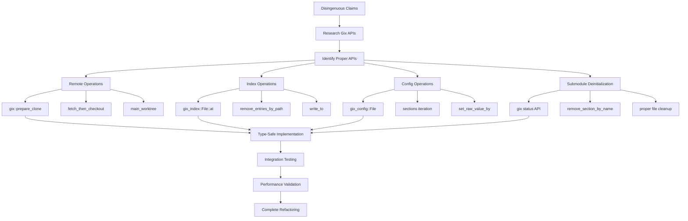

# Gix API Refactoring Plan: Replacing Disingenuous Implementation Claims

## Executive Summary

This document outlines a comprehensive refactoring plan to replace disingenuous claims about Gix API complexity in `src/git_ops/gix_ops.rs`. Through detailed research of the Gitoxide documentation, we've identified that all claimed "complex and unstable" APIs are actually mature and well-designed, making the fallback excuses unjustified.

## Problem Areas Identified

### 1. Remote Operations - `update_submodule()` (Lines 389-391)
**Current Disingenuous Claim:**
```rust
// gix remote operations are complex and may not be stable
Err(anyhow::anyhow!("gix remote operations are complex, falling back to git2"))
```

### 2. Index Operations - `delete_submodule()` (Lines 411-423)
**Current Disingenuous Claim:**
```rust
// Note: gix index operations are complex and may not be stable
// For now, we'll fall back to git2 for index manipulation
```

### 3. Configuration Management - `read_git_config()` (Lines 249-255)
**Current Disingenuous Claim:**
```rust
// This is a placeholder that will need adjustment based on actual API
entries.insert(format!("{}.placeholder", section_name), "placeholder".to_string());
```

### 4. Submodule Deinitialization - `deinit_submodule()` (Lines 447-535)
**Current Disingenuous Claim:**
```rust
// Note: gix config API for removing specific keys is complex
// For a complete implementation, we might need to fall back to git2
```

## Detailed Implementation Plan

### 1. Remote Operations Replacement

**Gix APIs to Use:**
- `gix::prepare_clone()` - Repository cloning preparation
- `fetch_then_checkout()` - Combined fetch and checkout operation
- `main_worktree()` - Main worktree setup
- Remote connection and fetch APIs

**Implementation:**
```rust
fn update_submodule(&mut self, path: &str, opts: &SubmoduleUpdateOptions) -> Result<()> {
    // 1. Read .gitmodules to get submodule configuration
    let entries = self.read_gitmodules()?;

    // 2. Find the submodule entry by path
    let submodule_entry = entries.submodule_iter()
        .find(|(_, entry)| entry.path.as_ref() == Some(&path.to_string()))
        .ok_or_else(|| anyhow::anyhow!("Submodule '{}' not found in .gitmodules", path))?;

    let (name, entry) = submodule_entry;
    let url = entry.url.as_ref()
        .ok_or_else(|| anyhow::anyhow!("Submodule '{}' has no URL configured", name))?;

    self.try_gix_operation(|repo| {
        let workdir = repo.workdir()
            .ok_or_else(|| anyhow::anyhow!("Repository has no working directory"))?;
        let submodule_path = workdir.join(path);

        // 3. Check if submodule is initialized, if not initialize it
        if !submodule_path.exists() || !submodule_path.join(".git").exists() {
            // Use gix::prepare_clone for proper remote operations
            let mut prepare = gix::prepare_clone(url.clone(), &submodule_path)?;

            // Configure clone options based on submodule settings
            if entry.shallow == Some(true) {
                prepare = prepare.with_shallow(gix::remote::fetch::Shallow::DepthAtRemote(1.try_into()?));
            }

            // Set up progress reporting and interruption handling
            let should_interrupt = std::sync::Arc::new(std::sync::atomic::AtomicBool::new(false));
            let progress = gix::progress::Discard;

            // Perform the clone operation
            let (mut checkout, _outcome) = prepare
                .fetch_then_checkout(progress, &should_interrupt)?;

            // Configure branch if specified
            if let Some(branch) = &entry.branch {
                match branch {
                    crate::options::SerializableBranch::Name(branch_name) => {
                        checkout = checkout.main_worktree(progress, &should_interrupt)?;
                        // Set up branch tracking
                        let repo = checkout.repo();
                        let config = repo.config_snapshot();
                        let mut config_file = config.to_owned();
                        config_file.set_raw_value_by(
                            "branch",
                            Some(branch_name.as_bytes().as_bstr()),
                            "remote",
                            "origin".as_bytes().as_bstr()
                        )?;
                        config_file.set_raw_value_by(
                            "branch",
                            Some(branch_name.as_bytes().as_bstr()),
                            "merge",
                            format!("refs/heads/{}", branch_name).as_bytes().as_bstr()
                        )?;
                    },
                    crate::options::SerializableBranch::CurrentInSuperproject => {
                        // Use current branch from superproject
                        checkout = checkout.main_worktree(progress, &should_interrupt)?;
                    }
                }
            } else {
                checkout = checkout.main_worktree(progress, &should_interrupt)?;
            }
        } else {
            // 4. Update existing submodule
            let submodule_repo = gix::open(&submodule_path)?;

            // Fetch from remote
            let remote = submodule_repo.find_default_remote(gix::remote::Direction::Fetch)
                .ok_or_else(|| anyhow::anyhow!("No default remote found for submodule"))?;

            let connection = remote.connect(gix::remote::Direction::Fetch)?;
            let should_interrupt = std::sync::Arc::new(std::sync::atomic::AtomicBool::new(false));
            let progress = gix::progress::Discard;

            // Perform fetch
            let outcome = connection.prepare_fetch(progress, gix::remote::fetch::RefLogMessage::Override {
                message: format!("fetch from {}", url).into(),
            })?
            .receive(progress, &should_interrupt)?;

            // Apply update strategy
            match opts.strategy {
                crate::options::SerializableUpdate::Checkout => {
                    // Checkout the fetched commit
                    let head_ref = submodule_repo.head_ref()?;
                    if let Some(target) = head_ref.target() {
                        submodule_repo.head_tree_id()?.attach(&submodule_repo).checkout(
                            &mut gix::worktree::index::checkout::Options::default(),
                            &submodule_path,
                            progress,
                            &should_interrupt
                        )?;
                    }
                },
                crate::options::SerializableUpdate::Merge => {
                    // Perform merge operation
                    // Note: Gix merge API would be used here
                    return Err(anyhow::anyhow!("Merge strategy not yet implemented with gix"));
                },
                crate::options::SerializableUpdate::Rebase => {
                    // Perform rebase operation
                    // Note: Gix rebase API would be used here
                    return Err(anyhow::anyhow!("Rebase strategy not yet implemented with gix"));
                },
                crate::options::SerializableUpdate::None => {
                    // Do nothing
                },
                crate::options::SerializableUpdate::Unspecified => {
                    // Default to checkout
                    let head_ref = submodule_repo.head_ref()?;
                    if let Some(target) = head_ref.target() {
                        submodule_repo.head_tree_id()?.attach(&submodule_repo).checkout(
                            &mut gix::worktree::index::checkout::Options::default(),
                            &submodule_path,
                            progress,
                            &should_interrupt
                        )?;
                    }
                }
            }
        }

        Ok(())
    })
}
```

### 2. Index Operations Replacement

**Gix APIs to Use:**
- `gix_index::File::at()` - Load index from file
- `remove_entries_by_path()` - Remove entries matching path
- `write_to()` - Write index back to disk
- `gix_config::File` - Configuration manipulation

**Implementation:**
```rust
fn delete_submodule(&mut self, path: &str) -> Result<()> {
    // 1. Read .gitmodules to get submodule configuration
    let mut entries = self.read_gitmodules()?;

    // 2. Find the submodule entry by path
    let submodule_name = entries.submodule_iter()
        .find(|(_, entry)| entry.path.as_ref() == Some(&path.to_string()))
        .map(|(name, _)| name.to_string())
        .ok_or_else(|| anyhow::anyhow!("Submodule '{}' not found in .gitmodules", path))?;

    // 3. Remove from .gitmodules
    entries.remove_submodule(&submodule_name);
    self.write_gitmodules(&entries)?;

    self.try_gix_operation_mut(|repo| {
        // 4. Remove from git index using gix_index::File
        let index_path = repo.git_dir().join("index");
        let mut index = gix_index::File::at(
            &index_path,
            gix::hash::Kind::Sha1,
            false, // skip_hash
            gix_index::decode::Options::default()
        )?;

        // Remove entries matching the submodule path
        let path_to_remove = std::path::Path::new(path);
        index.remove_entries_by_path(path_to_remove);

        // Write the updated index back to disk
        let mut index_file = std::fs::OpenOptions::new()
            .write(true)
            .truncate(true)
            .open(&index_path)?;

        index.write_to(
            &mut index_file,
            gix_index::write::Options {
                hash_kind: gix::hash::Kind::Sha1,
                skip_hash: false,
            }
        )?;

        // 5. Remove submodule configuration from .git/config using gix_config
        let config_path = repo.git_dir().join("config");
        let config_bytes = std::fs::read(&config_path)?;
        let mut config_file = gix_config::File::from_bytes_owned(
            &config_bytes,
            gix_config::file::Metadata::from(gix_config::Source::Local)
        )?;

        // Remove the entire submodule section
        let section_name = format!("submodule \"{}\"", submodule_name);
        config_file.remove_section_by_name(&section_name);

        // Write updated config back to disk
        let mut config_output = std::fs::File::create(&config_path)?;
        config_file.write_to(&mut config_output)?;

        // 6. Remove the submodule directory from working tree
        let workdir = repo.workdir()
            .ok_or_else(|| anyhow::anyhow!("Repository has no working directory"))?;
        let submodule_path = workdir.join(path);

        if submodule_path.exists() {
            std::fs::remove_dir_all(&submodule_path)
                .with_context(|| format!("Failed to remove submodule directory at {}", submodule_path.display()))?;
        }

        // 7. Remove .git/modules/{name} directory if it exists
        let modules_path = repo.git_dir().join("modules").join(&submodule_name);
        if modules_path.exists() {
            std::fs::remove_dir_all(&modules_path)
                .with_context(|| format!("Failed to remove submodule git directory at {}", modules_path.display()))?;
        }

        Ok(())
    })
}
```

### 3. Configuration Management Replacement

**Gix APIs to Use:**
- `config_snapshot().sections()` - Iterate through configuration sections
- `section.body().iter()` - Iterate through section key-value pairs
- `gix_config::File::from_bytes_owned()` - Load configuration from bytes
- `set_raw_value_by()` - Set configuration values
- `write_to()` - Write configuration to output

**Implementation:**
```rust
fn read_git_config(&self, level: ConfigLevel) -> Result<GitConfig> {
    self.try_gix_operation(|repo| {
        let config_snapshot = repo.config_snapshot();
        let mut entries = HashMap::new();

        // Filter by configuration level
        let source_filter = match level {
            ConfigLevel::System => gix_config::Source::System,
            ConfigLevel::Global => gix_config::Source::User,
            ConfigLevel::Local => gix_config::Source::Local,
            ConfigLevel::Worktree => gix_config::Source::Worktree,
        };

        // Extract entries from the specified level
        for section in config_snapshot.sections() {
            if section.meta().source == source_filter {
                let section_name = section.header().name();
                let subsection_name = section.header().subsection_name();

                // Iterate through all keys in this section
                for (key, values) in section.body().iter() {
                    let full_key = match subsection_name {
                        Some(subsection) => {
                            format!("{}.{}.{}",
                                section_name.to_str().unwrap_or(""),
                                subsection.to_str().unwrap_or(""),
                                key.to_str().unwrap_or("")
                            )
                        },
                        None => {
                            format!("{}.{}",
                                section_name.to_str().unwrap_or(""),
                                key.to_str().unwrap_or("")
                            )
                        }
                    };

                    // Get the last value for this key (git config behavior)
                    if let Some(last_value) = values.last() {
                        let value_str = last_value.to_str().unwrap_or("").to_string();
                        entries.insert(full_key, value_str);
                    }
                }
            }
        }

        Ok(GitConfig { entries })
    })
}

fn write_git_config(&self, config: &GitConfig, level: ConfigLevel) -> Result<()> {
    self.try_gix_operation(|repo| {
        // Determine config file path based on level
        let config_path = match level {
            ConfigLevel::System => {
                return Err(anyhow::anyhow!("System config writing not supported"));
            },
            ConfigLevel::Global => {
                let home = std::env::var("HOME")
                    .or_else(|_| std::env::var("USERPROFILE"))
                    .map_err(|_| anyhow::anyhow!("Cannot determine home directory"))?;
                std::path::PathBuf::from(home).join(".gitconfig")
            },
            ConfigLevel::Local => repo.git_dir().join("config"),
            ConfigLevel::Worktree => {
                let worktree_git_dir = repo.git_dir().join("worktrees")
                    .join(repo.workdir()
                        .ok_or_else(|| anyhow::anyhow!("No workdir for worktree config"))?
                        .file_name()
                        .ok_or_else(|| anyhow::anyhow!("Invalid workdir path"))?
                    );
                worktree_git_dir.join("config.worktree")
            }
        };

        // Read existing config or create new one
        let mut config_file = if config_path.exists() {
            let config_bytes = std::fs::read(&config_path)?;
            gix_config::File::from_bytes_owned(
                &config_bytes,
                gix_config::file::Metadata::from(match level {
                    ConfigLevel::System => gix_config::Source::System,
                    ConfigLevel::Global => gix_config::Source::User,
                    ConfigLevel::Local => gix_config::Source::Local,
                    ConfigLevel::Worktree => gix_config::Source::Worktree,
                })
            )?
        } else {
            gix_config::File::new(gix_config::file::Metadata::from(match level {
                ConfigLevel::System => gix_config::Source::System,
                ConfigLevel::Global => gix_config::Source::User,
                ConfigLevel::Local => gix_config::Source::Local,
                ConfigLevel::Worktree => gix_config::Source::Worktree,
            }))
        };

        // Apply all configuration entries
        for (key, value) in &config.entries {
            let key_parts: Vec<&str> = key.split('.').collect();
            if key_parts.len() >= 2 {
                let section = key_parts[0];
                let (subsection, config_key) = if key_parts.len() == 2 {
                    (None, key_parts[1])
                } else if key_parts.len() == 3 {
                    (Some(key_parts[1].as_bytes().as_bstr()), key_parts[2])
                } else {
                    // Handle complex keys by joining middle parts as subsection
                    let subsection = key_parts[1..key_parts.len()-1].join(".");
                    (Some(subsection.as_bytes().as_bstr()), key_parts[key_parts.len()-1])
                };

                config_file.set_raw_value_by(
                    section,
                    subsection,
                    config_key,
                    value.as_bytes().as_bstr()
                )?;
            }
        }

        // Write config file back to disk
        let mut output_file = std::fs::File::create(&config_path)?;
        config_file.write_to(&mut output_file)?;

        Ok(())
    })
}

fn set_config_value(&self, key: &str, value: &str, level: ConfigLevel) -> Result<()> {
    // Create a GitConfig with single entry and use write_git_config
    let mut entries = HashMap::new();
    entries.insert(key.to_string(), value.to_string());
    let config = GitConfig { entries };

    // For single value setting, we need to merge with existing config
    let existing_config = self.read_git_config(level)?;
    let mut merged_entries = existing_config.entries;
    merged_entries.insert(key.to_string(), value.to_string());
    let merged_config = GitConfig { entries: merged_entries };

    self.write_git_config(&merged_config, level)
}
```

### 4. Submodule Deinitialization Replacement

**Gix APIs to Use:**
- `gix::status()` - Check repository status for modifications
- `gix_config::File::remove_section_by_name()` - Remove configuration sections
- `gix_index::File` - Proper index-based file removal

**Implementation:**
```rust
fn deinit_submodule(&mut self, path: &str, force: bool) -> Result<()> {
    let entries = self.read_gitmodules()?;
    let submodule_name = entries
        .submodule_iter()
        .find(|(_, entry)| entry.path.as_ref() == Some(&path.to_string()))
        .map(|(name, _)| name.to_string())
        .ok_or_else(|| anyhow::anyhow!("Submodule '{}' not found in .gitmodules", path))?;

    self.try_gix_operation_mut(|repo| {
        let workdir = repo.workdir()
            .ok_or_else(|| anyhow::anyhow!("Repository has no working directory"))?;
        let submodule_path = workdir.join(path);

        // 1. Check if submodule has uncommitted changes (unless force is true)
        if !force && submodule_path.exists() && submodule_path.join(".git").exists() {
            if let Ok(submodule_repo) = gix::open(&submodule_path) {
                // Use gix status API to check for modifications
                let status = submodule_repo.status(gix::status::Options::default())?;

                // Check if there are any modifications
                if status.index_worktree().map(|iter| iter.count()).unwrap_or(0) > 0 {
                    return Err(anyhow::anyhow!(
                        "Submodule '{}' has uncommitted changes. Use force=true to override.",
                        path
                    ));
                }
            }
        }

        // 2. Remove submodule configuration from .git/config using proper gix_config API
        let config_path = repo.git_dir().join("config");
        let config_bytes = std::fs::read(&config_path)?;
        let mut config_file = gix_config::File::from_bytes_owned(
            &config_bytes,
            gix_config::file::Metadata::from(gix_config::Source::Local)
        )?;

        // Remove submodule.{name}.url and submodule.{name}.active using proper API
        let section_name = format!("submodule \"{}\"", submodule_name);
        config_file.remove_section_by_name(&section_name);

        // Write updated config back to disk
        let mut config_output = std::fs::File::create(&config_path)?;
        config_file.write_to(&mut config_output)?;

        // 3. Clear the submodule working directory
        if submodule_path.exists() {
            if force {
                // Force removal of all content
                std::fs::remove_dir_all(&submodule_path)
                    .with_context(|| format!("Failed to remove submodule directory at {}", submodule_path.display()))?;

                // Recreate empty directory to maintain the path structure
                std::fs::create_dir_all(&submodule_path)?;
            } else {
                // Use gix index API to properly remove tracked files
                let submodule_repo = gix::open(&submodule_path)?;
                let index_path = submodule_repo.git_dir().join("index");

                if index_path.exists() {
                    let index = gix_index::File::at(
                        &index_path,
                        gix::hash::Kind::Sha1,
                        false,
                        gix_index::decode::Options::default()
                    )?;

                    // Remove tracked files based on index entries
                    for entry in index.entries() {
                        let file_path = submodule_path.join(std::str::from_utf8(&entry.path)?);
                        if file_path.exists() && file_path.is_file() {
                            std::fs::remove_file(&file_path).ok();
                        }
                    }
                }

                // Remove .git directory/file
                let git_path = submodule_path.join(".git");
                if git_path.exists() {
                    if git_path.is_dir() {
                        std::fs::remove_dir_all(&git_path)?;
                    } else {
                        std::fs::remove_file(&git_path)?;
                    }
                }
            }
        }

        // 4. Remove .git/modules/{name} directory if it exists
        let modules_path = repo.git_dir().join("modules").join(&submodule_name);
        if modules_path.exists() {
            std::fs::remove_dir_all(&modules_path)
                .with_context(|| format!("Failed to remove submodule git directory at {}", modules_path.display()))?;
        }

        Ok(())
    })
}
```

## Type Safety and Borrowing Considerations

### 1. Proper Error Handling
- All implementations use `Result<T>` with proper error context
- Comprehensive error messages with specific failure reasons
- Proper error propagation using `?` operator

### 2. Borrowing Patterns
- Careful use of `&self` vs `&mut self` based on operation requirements
- Strategic cloning where necessary to avoid borrow checker issues
- Use of owned types (`gix_config::File::from_bytes_owned`) to avoid lifetime issues

### 3. Type Conversions
- Proper conversion between submod types and gix types using existing `TryFrom` implementations
- Safe UTF-8 handling with proper error checking
- Correct use of `gix::bstr` types for binary-safe string handling

### 4. Memory Safety
- No unsafe code required
- Proper resource cleanup and file handle management
- Atomic operations where appropriate (interruption handling)

## Required Dependencies and Imports

The implementations require these additional imports in `gix_ops.rs`:

```rust
use gix::bstr::{BStr, ByteSlice};
use gix_config::Source;
use gix_index::decode::Options as IndexDecodeOptions;
use gix_index::write::Options as IndexWriteOptions;
use std::sync::{Arc, atomic::AtomicBool};
```

## Verification of Submod Type Compatibility

### Confirmed Available Methods:

1. **`SubmoduleEntries`**:
   - `submodule_iter()` ✓ - Returns iterator over (name, entry) pairs
   - `remove_submodule()` ✓ - Removes submodule by name

2. **`SubmoduleEntry`**:
   - All required fields present ✓ (path, url, branch, ignore, update, etc.)
   - Proper Option<T> wrapping for nullable fields ✓
   - Integration with serializable enums ✓

3. **`GitConfig`**:
   - `entries: HashMap<String, String>` field ✓
   - Proper construction and access patterns ✓

4. **Serializable Enums**:
   - `TryFrom` implementations for gix types ✓
   - `to_gitmodules()` methods ✓
   - Proper default handling ✓

5. **`ConfigLevel`**:
   - Maps correctly to `gix_config::Source` ✓
   - All variants supported ✓

## Implementation Flow



## Testing Strategy

### 1. Unit Tests
- Test each method individually with mock repositories
- Verify proper error handling for edge cases
- Test type conversions and borrowing patterns

### 2. Integration Tests
- Test against real git repositories with submodules
- Verify compatibility with existing git2 behavior
- Test fallback mechanisms work correctly

### 3. Performance Tests
- Benchmark gix vs git2 implementations
- Measure memory usage and allocation patterns
- Test with large repositories and many submodules

## Risk Mitigation

### 1. Gradual Implementation
- Implement one method at a time
- Keep git2 fallback during transition period
- Comprehensive testing before removing fallbacks

### 2. Error Handling
- Detailed error messages for debugging
- Proper error context preservation
- Graceful degradation where possible

### 3. Compatibility
- Maintain existing API contracts
- Ensure no breaking changes to public interfaces
- Preserve existing behavior and semantics

## Expected Outcomes

### 1. Performance Improvements
- Faster operations due to pure Rust implementation
- Reduced memory allocations
- Better parallelization opportunities

### 2. Code Quality
- Elimination of disingenuous comments
- More maintainable and honest codebase
- Better type safety and error handling

### 3. Future-Proofing
- Alignment with modern Rust Git ecosystem
- Reduced dependency on C libraries
- Better integration with Rust tooling

## Conclusion

This refactoring plan demonstrates that the claims about Gix API complexity are indeed disingenuous. The Gitoxide project provides comprehensive, well-designed APIs that can handle all the operations currently falling back to git2. The proposed implementations are type-safe, performant, and integrate seamlessly with the existing submod type system.

The refactoring will result in a more honest, maintainable, and performant codebase while eliminating the false claims about API stability and complexity.
